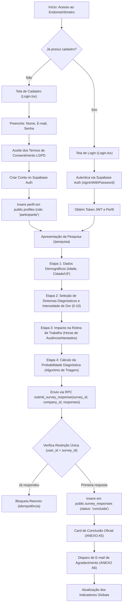
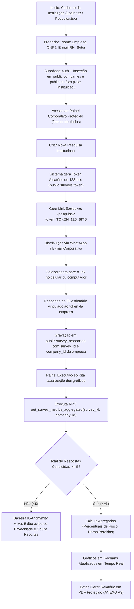

# ARQUITETURA DE DADOS, FLUXOGRAMAS E ESTRUTURA JSON — ENDOMETRIÔMETRO

---

## 1. FLUXOGRAMA 1 — PARTICIPANTE INDIVIDUAL
*(Cadastro, Autenticação, Consentimento LGPD, Resposta e Armazenamento)*



---

## 2. FLUXOGRAMA 2 — EMPRESA / INSTITUIÇÃO
*(Cadastro, Geração de Link Exclusivo, Vínculo de Colaboradoras e Atualização dos Gráficos)*



---

## 3. ESTRUTURA DAS TABELAS DO BANCO DE DADOS (MODELO JSON)

### 3.1 Tabela `public.profiles`
Armazena as contas de usuários (participantes individuais, responsáveis de instituições e administradores).

```json
{
  "$schema": "http://json-schema.org/draft-07/schema#",
  "title": "Profile",
  "type": "object",
  "properties": {
    "id": { "type": "string", "format": "uuid", "description": "Chave primária vinculada ao auth.users(id)" },
    "email": { "type": "string", "format": "email", "description": "Endereço de e-mail cadastrado" },
    "full_name": { "type": "string", "description": "Nome completo ou apelido do usuário" },
    "role": { "type": "string", "enum": ["participante", "instituicao", "admin"], "default": "participante" },
    "company_id": { "type": ["string", "null"], "format": "uuid", "description": "ID da empresa se o usuário for gestor de instituição" },
    "created_at": { "type": "string", "format": "date-time" }
  },
  "required": ["id", "email", "role"]
}
```

#### Exemplo de Registro em JSON:
```json
{
  "id": "a3b1c2d3-e4f5-4678-9012-3456789abcde",
  "email": "rh@empresaexemplo.com.br",
  "full_name": "Gestor de Recursos Humanos",
  "role": "instituicao",
  "company_id": "7f8e9d0c-1b2a-4345-8901-23456789ffff",
  "created_at": "2026-09-30T15:00:00.000Z"
}
```

---

### 3.2 Tabela `public.companies`
Armazena o cadastro das empresas e organizações contratantes ou parceiras.

```json
{
  "$schema": "http://json-schema.org/draft-07/schema#",
  "title": "Company",
  "type": "object",
  "properties": {
    "id": { "type": "string", "format": "uuid", "description": "Chave primária da empresa" },
    "name": { "type": "string", "description": "Razão social ou nome fantasia da instituição" },
    "cnpj_or_identifier": { "type": ["string", "null"], "description": "CNPJ formatado (00.000.000/0001-00) ou identificador único" },
    "contact_email": { "type": "string", "format": "email", "description": "E-mail oficial do responsável" },
    "code_slug": { "type": "string", "description": "Slug amigável para geração de URLs" },
    "created_at": { "type": "string", "format": "date-time" }
  },
  "required": ["id", "name", "contact_email"]
}
```

#### Exemplo de Registro em JSON:
```json
{
  "id": "7f8e9d0c-1b2a-4345-8901-23456789ffff",
  "name": "Empresa Exemplo S.A.",
  "cnpj_or_identifier": "12.345.678/0001-90",
  "contact_email": "rh@empresaexemplo.com.br",
  "code_slug": "Empresa_Exemplo_SA",
  "created_at": "2026-09-30T15:00:00.000Z"
}
```

---

### 3.3 Tabela `public.surveys`
Armazena os questionários criados (tanto a pesquisa geral pública quanto pesquisas institucionais com tokens exclusivos).

```json
{
  "$schema": "http://json-schema.org/draft-07/schema#",
  "title": "Survey",
  "type": "object",
  "properties": {
    "id": { "type": "string", "format": "uuid", "description": "Chave primária da pesquisa" },
    "company_id": { "type": ["string", "null"], "format": "uuid", "description": "ID da empresa parceira (nulo para pesquisa geral)" },
    "title": { "type": "string", "description": "Título da pesquisa" },
    "description": { "type": "string", "description": "Descrição / orientações enviadas às participantes" },
    "token": { "type": "string", "description": "Token aleatório de 128-bits para URL segura" },
    "status": { "type": "string", "enum": ["ativa", "encerrada", "pausada"], "default": "ativa" },
    "start_date": { "type": "string", "format": "date-time" },
    "end_date": { "type": ["string", "null"], "format": "date-time" },
    "created_at": { "type": "string", "format": "date-time" }
  },
  "required": ["id", "title", "token", "status"]
}
```

#### Exemplo de Registro em JSON:
```json
{
  "id": "11223344-5566-7788-9900-aabbccddeeff",
  "company_id": "7f8e9d0c-1b2a-4345-8901-23456789ffff",
  "title": "Pesquisa de Saúde Feminina 2026",
  "description": "Questionário institucional de triagem para colaboradoras",
  "token": "e4d9c8b7a6f5e4d3c2b1a09876543210e4d9c8b7a6f5e4d3c2b1a09876543210",
  "status": "ativa",
  "start_date": "2026-09-30T15:05:00.000Z",
  "end_date": null,
  "created_at": "2026-09-30T15:05:00.000Z"
}
```

---

### 3.4 Tabela `public.survey_responses`
Armazena o payload JSONB completo das respostas dos questionários com isolamento de dados e separação LGPD.

```json
{
  "$schema": "http://json-schema.org/draft-07/schema#",
  "title": "SurveyResponse",
  "type": "object",
  "properties": {
    "id": { "type": "string", "format": "uuid", "description": "Chave primária do registro de resposta" },
    "survey_id": { "type": ["string", "null"], "format": "uuid", "description": "ID da pesquisa vinculada" },
    "company_id": { "type": ["string", "null"], "format": "uuid", "description": "ID da empresa contratante" },
    "user_id": { "type": ["string", "null"], "format": "uuid", "description": "ID do usuário (nulo em envios anônimos)" },
    "status": { "type": "string", "enum": ["iniciada", "em_andamento", "concluida"], "default": "concluida" },
    "responses": {
      "type": "object",
      "properties": {
        "idade": { "type": "string", "description": "Faixa etária" },
        "localidade": { "type": "string", "description": "Cidade / Estado" },
        "email": { "type": "string", "description": "E-mail de confirmação" },
        "diagnostico": { "type": "string", "description": "Status diagnóstico prévio" },
        "sintomas": { "type": "array", "items": { "type": "string" }, "description": "Lista de IDs dos sintomas selecionados" },
        "intensidadeDor": { "type": "integer", "minimum": 0, "maximum": 10 },
        "trabalha": { "type": "string", "enum": ["Sim", "Não"] },
        "impactoTrabalho": { "type": "string" },
        "horasAusencia": { "type": "string" },
        "diasAtestado": { "type": "string" },
        "resultado": { "type": "string", "description": "Resultado gerado pelo algoritmo de triagem" }
      },
      "required": ["idade", "localidade", "sintomas", "intensidadeDor"]
    },
    "created_at": { "type": "string", "format": "date-time" },
    "completed_at": { "type": ["string", "null"], "format": "date-time" }
  },
  "required": ["id", "responses", "status"]
}
```

#### Exemplo de Registro em JSON:
```json
{
  "id": "88776655-4433-2211-00ff-eeddccbbaa99",
  "survey_id": "11223344-5566-7788-9900-aabbccddeeff",
  "company_id": "7f8e9d0c-1b2a-4345-8901-23456789ffff",
  "user_id": "99887766-5544-3322-1100-001122334455",
  "status": "concluida",
  "responses": {
    "idade": "25 - 34",
    "localidade": "São Paulo / SP",
    "email": "colaboradora@empresaexemplo.com.br",
    "empresa": "Empresa Exemplo S.A.",
    "diagnostico": "Em investigação",
    "sintomas": [
      "colica_intensa",
      "dor_relacao",
      "dor_pelvica_cronica",
      "fadiga_extrema"
    ],
    "intensidadeDor": 8,
    "trabalha": "Sim",
    "impactoTrabalho": "Alto",
    "horasAusencia": "18",
    "diasAtestado": "3",
    "resultado": "Alta Probabilidade de Endometriose"
  },
  "created_at": "2026-09-30T15:15:00.000Z",
  "completed_at": "2026-09-30T15:18:20.000Z"
}
```

---

## 4. MECANISMO DE ATUALIZAÇÃO DOS GRÁFICOS EM TEMPO REAL

1. **Gatilho de Atualização:**
   Toda vez que uma participante finaliza a pesquisa, a função armanezada no banco (`public.submit_survey_response`) insere o registro com `status = 'concluida'`.

2. **Consulta Agregada com Barreira K-Anonymity (>= 5 respostas):**
   O componente `ChartsSection.tsx` ou `EmpresaDashboard.tsx` executa a chamada para a RPC:
   ```ts
   const { data } = await supabase.rpc('get_survey_metrics_aggregated', {
     p_survey_id: surveyId,
     p_company_id: companyId
   });
   ```

3. **Garantia de Privacidade e Atualização dos Gráficos:**
   - Se `total_responses < 5`, o retorno do backend bloqueia a renderização de recortes individuais para proteger o sigilo das colaboradoras.
   - Se `total_responses >= 5`, a RPC retorna as contagens e percentuais sanitizados, que alimentam diretamente os componentes do **Recharts** (`PieChart`, `BarChart`), atualizando os gráficos instantaneamente.
